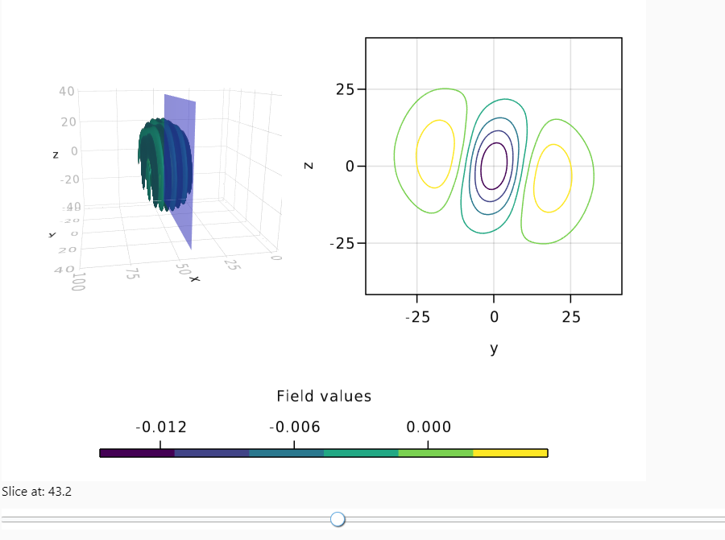

# SDFResultViewer

[](https://ctp-fpub.github.io/SDFResultViewer.jl/stable)
[](https://ctp-fpub.github.io/SDFResultViewer.jl/dev)
[](https://github.com/ctp-fpub/SDFResultViewer.jl/actions)
[](https://codecov.io/gh/ctp-fpub/SDFResultViewer.jl)

This package aims to provide visualization tools for [EPOCH](https://cfsa-pmw.warwick.ac.uk/mediawiki/index.php/EPOCH:FAQ) simulations.

## Installation

In order to use this package you need to add the [ctp-fpub Julia registry](https://github.com/ctp-fpub/JuliaRegistry)
```
]registry add https://github.com:ctp-fpub/JuliaRegistry.git
```

After that, you can install the package with
```
]add SDFResultViewer
```

## Quck start

```julia
using SDFResults
using SDFResultViewer
using WGLMakie
using Unitful
using PhysicalConstants.CODATA2018: c_0, ε_0, m_e, e

dir = "epoch_simulation"
sim = read_simulation(dir)
file = sim[4]

λ = get_parameter(file, :lambda)
ω = 2π * c_0 / λ
nc = (ε_0 * m_e) / e^2 * ω^2

add_λ_units(λ)
Ex = file[:ex]

scalar_field_widget(uconvert(unit_E, unit_l, Ex))
```


